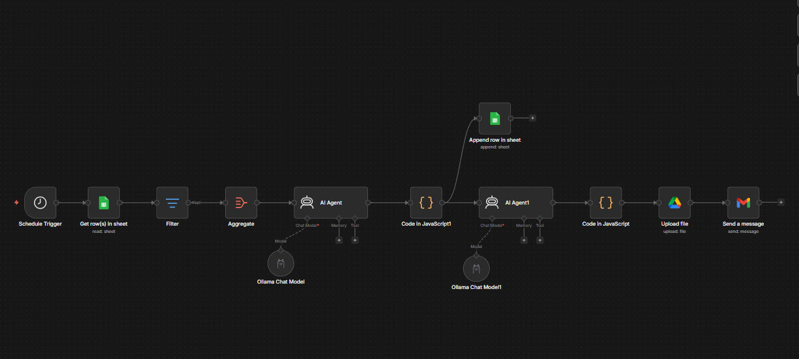

# AI-Driven Food Waste Reduction System

An automated workflow that helps supermarkets reduce food waste by turning near-expiry products into attractive combo deals, generated by a locally hosted AI model.

Built as my Technology Specialisation project at Aarhus University (MSc in Technology Based Business Development, 2026).

## What it does

1. Reads product inventory from Google Sheets, including expiry dates
2. Identifies products that are close to expiring
3. Sends the product list to a locally hosted Llama 3 model (via Ollama), which pairs near-expiry products with complementary items and writes combo-deal offers
4. A JavaScript parser node cleans the AI output and calculates discounted prices deterministically
5. Logs the generated deals to a results tab in Google Sheets
6. Generates a promotional flyer image for the deals with FLUX (via Hugging Face) and uploads it to Google Drive
7. Sends a finished HTML marketing email through Gmail with the deal table and a link to the flyer

All of this runs automatically on a daily schedule in an n8n workflow. No cloud AI APIs are used for the text generation, so product data stays local.

## Tech stack

- **n8n** (self-hosted in Docker) - workflow automation
- **Llama 3 via Ollama** - local LLM for deal generation
- **JavaScript** - custom parser node and price calculations
- **Google Sheets API** - inventory source and results log
- **Google Drive API** - image storage
- **Hugging Face / FLUX** - AI image generation
- **Gmail API** - automated HTML email output

## How to run it

1. Install Docker Desktop and run n8n in a container
2. Install Ollama on the host machine and pull Llama 3: `ollama pull llama3`
3. Start Ollama with `ollama serve`
4. In n8n, import `workflow.json` (in this repo)
5. Create a new Google Sheet with two tabs: **Inventory** and **Combo Results**. Import `sample_inventory.csv` (in this repo) into the Inventory tab
6. Connect your own Google Sheets, Google Drive, and Gmail credentials in the credential nodes, and point the two Google Sheets nodes at your new spreadsheet
7. In the image generation code node, replace `YOUR_HUGGINGFACE_TOKEN` with your own Hugging Face access token
8. Point the Ollama node at `http://host.docker.internal:11434` (this is how the Docker container reaches Ollama on the host)
9. Run the workflow

## Things I learned building this

- Docker containers cannot reach `localhost` on the host machine; `host.docker.internal` is needed for the n8n container to talk to Ollama
- LLM output is unreliable for math, so price calculations were moved out of the prompt and into a deterministic JavaScript parser node
- `this.helpers.httpRequest` is the correct way to make API calls from n8n code nodes

## Results

The system was tested with five documented end-to-end runs on realistic inventory data, producing complete combo-deal email campaigns with AI-generated text, calculated prices, and generated images.
